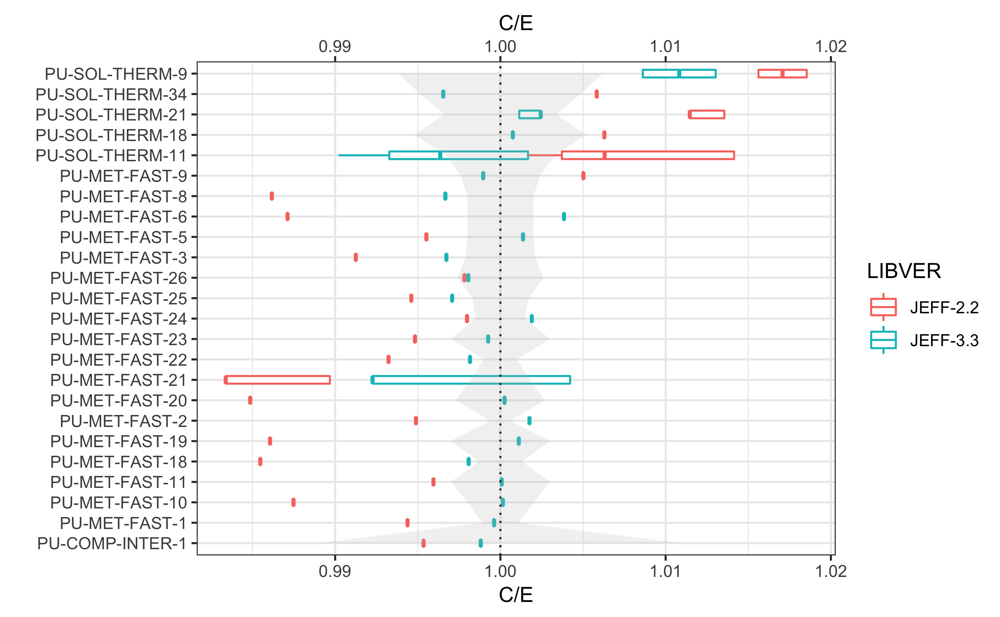
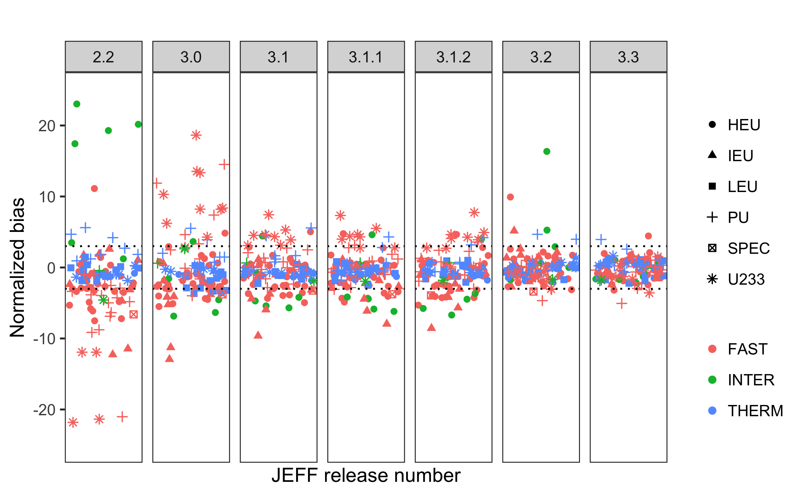
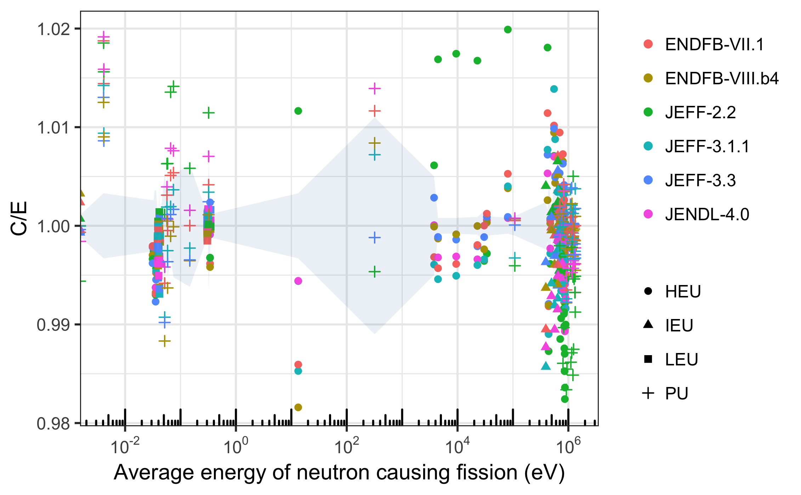

[](https://travis-ci.org/fmichelsendis/sendis)
[]()
 
<br>
 

<br><br>  

<p style="color:#70797f;font-weight:100; font-size: large;
font-family:Helvetica"> Screening evaluated nuclear data integral performance </p>


```{r setup, include = FALSE}
knitr::opts_chunk$set(
  collapse = TRUE,
  comment = "#>", 
  echo=FALSE, 
  message=FALSE, 
  warning=FALSE, 
  eval=TRUE,
  fig.align='left'
  ) 

 
library(dplyr)
library(plotly) 

```




 

<br>

The **sendis** R package provides an easy access to datasets and functions that expedite common tasks in the comparison of integral benchmarking performance of nuclear data libraries.

## Background

The ability of a nuclear data library to accurately reproduce, in particle-transport simulations, the observables of benchmark-quality integral experiments plays a decisive role in the data validation process and therefore also in the decision-making process of assembling any nuclear data library. 

The work presented here aims at providing elements of answers to the following questions: 

* How do different nuclear data libraries compare in terms of integral performance? 
* How has the integral performance of evaluated nuclear data libraries evolved across different releases?
* How do two assessments provided by two different benchmarking *suites* compare to each other?
* How to build a consistend benchmarking comparison across different assessments done by different institutions?
* How to spot general trends and outliers? 

For the comparison of critical experiments, some helpful tools have been developed in this work.  

### Sources 


* [DICE](https://www.oecd-nea.org/science/wpncs/icsbep/dice.html) (OECD NEA)
 
## Examples

Interactive graphs are easily rendered with plotly : 

```{r,make myplotly.html, fig.align='center', eval=FALSE}

data(sendis) 
df<-filter(sendis, INST=="NEA", VER!="2.2")
p1<-plot_cumulchi(df)%>%
  layout(xaxis = list(title = "Benchmark suite"),
         yaxis = list(title = TeX("\\chi^2")))%>%
  config(mathjax = "cdn")
# to display later using iframe, in order to render Mathjax : 
# htmlwidgets::saveWidget(p1, "myplot.html")

```
 

```{css, echo=FALSE}
.holds-the-iframe {
  background:url(man/figures/pacman_loader.gif) center center no-repeat;
 }
```
 
<p align="center">
<div class="holds-the-iframe"><iframe src="files/myplot.html" width="750" height="450" scrolling="no" seamless="seamless" frameBorder="0"> </iframe></div>
</p>
 
## Reproducible, automated reporting 

[Rmarkdown](https://rmarkdown.rstudio.com/) is used to generate automated diagnosis pdf reports. 

<p align="center">
<iframe 
src="files/Report.pdf"
width="500"
height="700"
style="border:2px solid orange">
</iframe>
</p>


## The sendis app 

For seeing trends and filtering through the data, an interactive Shiny application has been developed. Find out more about the [sendis app](https://sendislab.org/app.html).  
 
 


