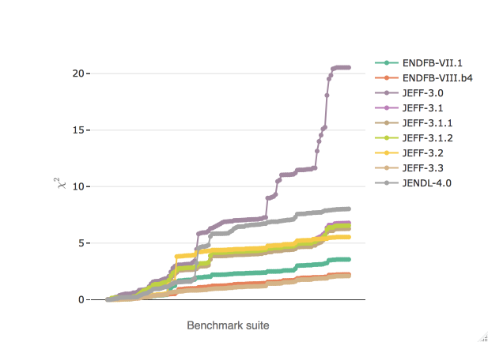

[](https://travis-ci.org/fmichelsendis/sendis)
[]()
 
<br>
 

<br><br>  

<p style="color:#70797f;font-weight:100; font-size: large;
font-family:Helvetica"> Screening evaluated nuclear data integral performance </p>


```{r setup, include = FALSE}
knitr::opts_chunk$set(
  collapse = TRUE,
  comment = "#>", 
  echo=FALSE, 
  message=FALSE, 
  warning=FALSE, 
  eval=TRUE,
  fig.align='center'
  #fig.width = 100pct
  ) 

htmltools::tagList(rmarkdown::html_dependency_font_awesome())

library(dplyr)
library(plotly) 

```



 

<br>

The **sendis** R package provides datasets and functions to expedite common tasks in the comparison of integral benchmarking performance of nuclear data libraries.

## Background

The ability of a nuclear data library to accurately reproduce, in particle-transport simulations, the observables of integral benchmark experiments plays a decisive role in the data validation process. Under the term *benchmarking*, the analyst tries to answer the following questions : 

* How do different nuclear data libraries, different versions of the same library or different candidate files compare in terms of integral performance? 
* How do two assessments provided by two different benchmarking *suites* compare to each other?
* How to spot general trends and outliers? 

For the comparison of critical benchmarking, some helpful tools that help with the questions above have been developed in this package.  

### Sources 


* [DICE](https://www.oecd-nea.org/science/wpncs/icsbep/dice.html) (OECD NEA)
 
## Examples

Interactive graphs are easily rendered using plotly : 

```{r,make myplotly.html, fig.align='center', eval=FALSE}

data(sendis) 
df<-filter(sendis, INST=="NEA", VER!="2.2")
p1<-plot_cumulchi(df)%>%
  layout(xaxis = list(title = "Benchmark suite"),
         yaxis = list(title = TeX("\\chi^2")))%>%
  config(mathjax = "cdn")
# to display later using iframe, in order to render Mathjax : 
# htmlwidgets::saveWidget(p1, "myplot.html")

```
 

```{css, echo=FALSE}
 
div.blue { background-color:#e6f0ff; border-radius: 5px; padding: 20px;}
 

.holds-the-iframe {
  background:url(files/pacman_loader.gif) center center no-repeat;
}

.col-left{
  float: left;
  width: 50%;
  text-align: left;
}

.col-right{
  float: right;
  width: 50%;
  text-align: right;
} 

```
 
```{r, example code, echo=TRUE, eval=TRUE}
# Load library
library(sendis)

# Filter through data as needed 
df<-filter(sendis, INST=="NEA")

# Plot
sendis::plot_cumulchi(df)
```
  
 
## Reproducible, automated reporting 
 
<div class=col-left>


[Rmarkdown](https://rmarkdown.rstudio.com/) is used to generate automated diagnosis pdf reports. 

  * Automatically compile plots and comparison tables;
  * Transparent, reproducible workflow;
  * Easily updatable with new or corrected data; 
</div>
<div class=col-right>
<br>
<br>
<br>
<center>
[<span style="font-size: 30px; color: #ffad33;">
  <i class="fa fa-arrow-alt-circle-right"></i>
</span>](files/Report.pdf)
<br>
Sample report
<br>
<br>
<br>
</center>
</div>

<br>
 

## The sendis app 

For seeing trends and filtering through the data, an interactive Shiny application has been developed. Find out more about the [sendis app](https://sendislab.org/app.html).  
 
 


